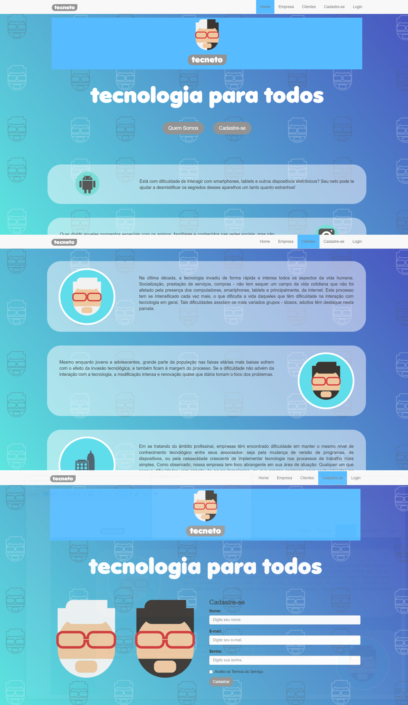

# Tecneto

#### UNIFEI WEB Systems Programming Project - First WebSite

Tecneto was my first website developed (2017), materializing the idea of creating a company that would provide technology support services to people who were not familiar with applications and websites, such as Netflix, Spotify, Youtube, among others.

#### :wrench: Technologies and Langs Used:
- HTML 5
- CSS 3
- JavaScript
- Bootstrap
- PHP

